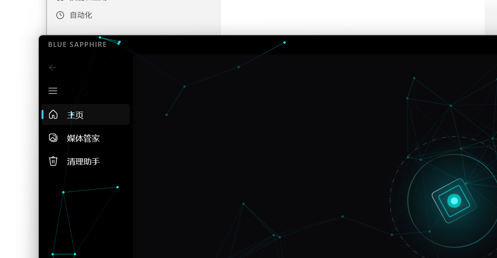
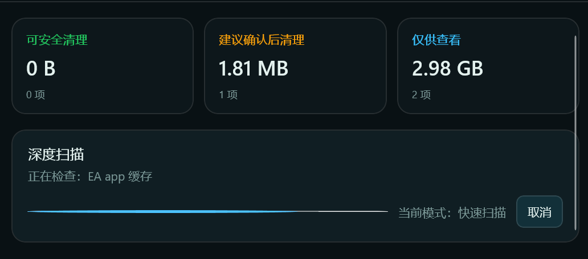
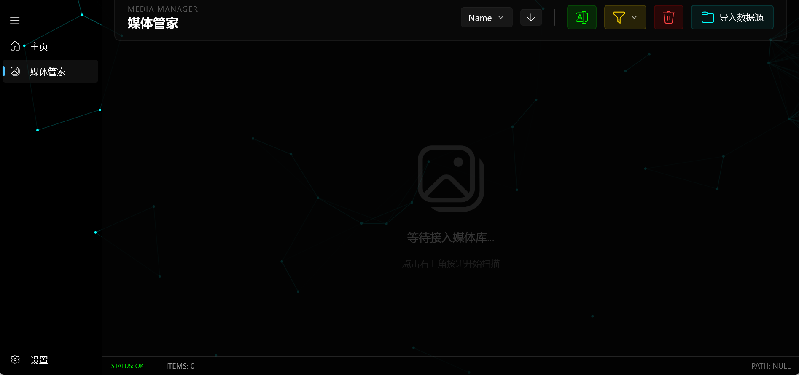

<div align="center">
  
  <h1>BlueSapphire 蓝宝石工具箱</h1>
  <p>面向 Windows 10/11 的智能桌面工具箱</p>
  <p><strong>AI 中控 · 安全清理 · 媒体管理 · 全局任务中心</strong></p>
  <p>WinUI 3 · .NET 8 · Windows App SDK · x64</p>
</div>

---

## 项目简介

BlueSapphire 是一款面向 Windows 的现代化桌面工具箱。

项目以“本地工具负责可靠执行，AI 负责理解、编排和解释”为设计原则，将系统清理、图片管理、任务进度和智能助理整合在同一个应用中。

当前版本：`1.0.3`

## 核心功能

### AI 智能助手

AI 助手不是单纯的聊天窗口，而是 BlueSapphire 的自然语言操作入口。

- 使用自然语言启动快速扫描或深度扫描
- 分析清理结果、历史记录和失败原因
- 打开应用内指定功能
- 生成跨模块任务计划和只读操作预览
- 分析图片目录、完全重复图片和空间占用
- 生成安全的清理规则草稿
- 调用经过审核的 MCP、Web Skill 和 Agent Skill
- 保存带范围和有效期的长期偏好
- 大模型不可用时提供本地降级指令

所有删除、移动、写入、第三方调用等操作都必须经过用户确认。

### 全局任务中心

任务中心统一管理清理、媒体和 AI 工具任务。

- 页面切换后任务继续运行
- 显示实时进度、当前阶段和执行时间线
- 支持用户主动取消
- 使用幂等键避免相同任务重复执行
- 应用重新启动后识别未完成任务
- 未完成的删除或写入任务不会自动续跑
- 清理页面与 AI 助手共享最近扫描结果

### 清理助手

清理助手提供从扫描、确认、执行到恢复的安全闭环。

- 快速扫描常见临时文件、缓存、日志和开发工具缓存
- 深度扫描应用缓存、系统更新缓存、诊断文件和大体积占用
- 支持选择系统盘或多个磁盘
- 对大文件和疑似卸载残留进行保守提示
- 支持取消扫描，并保持连续、不会倒退的扫描进度
- 支持排除路径、失败重试和管理员模式
- 支持导入、刷新、停用和恢复清理规则
- 支持定期提醒和低风险自动保洁

扫描结果分为：

| 风险级别 | 默认行为 | 说明 |
|---|---|---|
| 低风险 | 可默认勾选 | 通常为可重新生成的缓存或临时内容 |
| 建议确认 | 默认不勾选 | 可能影响登录状态、首次启动速度或诊断信息 |
| 仅供查看 | 不允许批量清理 | 大文件、未知目录和疑似残留等高风险对象 |

多数内置规则优先使用隔离区，支持恢复最近一次清理或单独恢复某个项目。

### 媒体管家

媒体管家用于本地图片整理和批处理。

- 扫描文件夹或导入指定图片
- 使用 SHA-256 检测完全重复图片
- 使用 dHash 生成相似图片候选
- 按名称、日期和大小排序
- 搜索文件名、路径和自定义标签
- 批量重命名并提供执行前预览
- 添加、修改和筛选本地标签
- 批量转换 JPEG、PNG、BMP、GIF、TIFF
- 调整尺寸、裁剪、亮度、对比度、饱和度和锐度
- 删除操作优先移入系统回收站

AI 还可以对媒体目录执行只读分析、生成按年月归档预览，并在用户单独确认后执行归档或完全重复图片治理。

## AI 安全与隐私

BlueSapphire 对 AI 工具调用采用保守授权模型。

- 扫描授权不等于删除授权
- 缓存清理授权不等于媒体处理授权
- 清理、媒体移动和第三方工具调用分别确认
- 最近扫描结果超过有效期后不能用于删除
- 确认授权具有操作范围和有效期
- AI 生成的清理规则默认高风险、仅查看、不自动启用
- 用户名、邮箱、API Key、Token 和敏感 URL 参数会在发送模型前脱敏
- API Key、对话历史和长期记忆使用当前 Windows 账户加密
- 任务持久化只保存摘要，不保存待删除文件清单
- 第三方 MCP、Web Skill 和 Agent Skill 默认不被信任

详细设计参见 [AI 智能助手架构](docs/ai-assistant-architecture.md)。

## 长期记忆

AI 长期记忆支持：

- 查看、编辑和删除
- 全局、清理、媒体、写作等适用范围
- 自定义有效期
- 单条启用或停用
- 暂停全部长期记忆
- 旧版加密记忆自动迁移

长期记忆只用于表达方式和非安全偏好，不能代替本次操作确认。

## 当前页面

- `主页`：应用入口和功能概览
- `AI 智能助手`：自然语言对话与工具编排
- `任务中心`：后台任务、进度、时间线和取消
- `媒体管家`：图片扫描、去重、整理和批处理
- `清理助手`：空间扫描、安全清理、恢复和规则管理
- `设置`：主题、模型、网络、隐私和应用行为配置

## 技术栈

- `.NET 8`
- `WinUI 3`
- `Windows App SDK`
- `CommunityToolkit.Mvvm`
- `Win2D`
- `Markdig`
- `Microsoft.Extensions.DependencyInjection`
- `xUnit`

运行目标：

- Windows 10 1809 或更高版本
- Windows 11
- x64
- Self-contained 发布

## 安装

正式版本通过 GitHub Releases 发布：

[下载 BlueSapphire](https://github.com/lk1015646426/BlueSapphire/releases)

当前安装包采用 self-contained 发布，普通用户不需要额外安装 .NET SDK。

## 本地开发

### 环境要求

- Visual Studio 2022
- .NET 8 SDK
- Windows App SDK 开发环境
- Windows 10/11 x64

### 获取源码

```powershell
git clone https://github.com/lk1015646426/BlueSapphire.git
cd BlueSapphire
```

### 构建

```powershell
dotnet build BlueSapphire.slnx
```

### 运行测试

```powershell
dotnet test BlueSapphire.Tests\BlueSapphire.Tests.csproj
```

当前测试基线：`165` 项自动化测试。

### Release 构建

```powershell
dotnet build BlueSapphire.csproj -c Release
```

### 发布

```powershell
dotnet publish BlueSapphire.csproj `
  -c Release `
  -r win-x64 `
  --self-contained true `
  -p:WindowsPackageType=None
```

## 安装包构建

仓库中的 `installer.iss` 只接受干净的发布目录。

```powershell
ISCC.exe `
  /dSourcePath="C:\path\to\publish" `
  /dMyAppName="BlueSapphire" `
  /dMyAppVersion="1.0.3" `
  /dMyAppPublisher="BlueSapphire Team" `
  /dMyAppId="{{8D43FBFA-A424-4FED-BDE6-6C586D7D13EE}" `
  installer.iss
```

禁止直接使用仓库根目录打包，避免把测试、缓存和开发文件带入安装包。

## 项目结构

```text
BlueSapphire/
├── Assets/                     # 图标、内置规则与运行时资源
├── BlueSapphire.Tests/         # 自动化测试
├── Controls/                   # 通用 WinUI 控件
├── Helpers/                    # 配置、转换和辅助功能
├── Interfaces/                 # 页面与服务交互接口
├── Models/                     # 清理、媒体、AI 和任务模型
├── Services/                   # 扫描、执行、AI、媒体和安全服务
├── Themes/                     # 统一主题资源
├── Tools/                      # 主导航工具定义
├── ViewModels/                 # MVVM 视图模型
├── Views/                      # AI、任务中心和对话框页面
├── docs/                       # 架构文档与截图
├── installer.iss               # Inno Setup 安装脚本
└── BlueSapphire.csproj         # 主项目
```

## 截图

### 主页



### 清理助手



### 媒体管家



## 质量状态

- Debug 自动化测试：165 项通过
- Release 构建：通过
- 编译警告：0
- 清理、恢复、任务幂等、共享上下文、隐私脱敏和媒体规则均有测试覆盖

## 使用边界

- 系统级清理可能需要管理员权限
- 大文件分析属于抽样分析，不代表全盘穷举
- 相似图片只提供候选，必须人工确认
- AI 服务需要用户配置受支持供应商的 API Key
- 外部 MCP 和技能的安全性由其提供方负责，BlueSapphire 会保留确认和调用边界

## 参与项目

欢迎通过 Issues 提交问题、建议和真实场景反馈，也欢迎通过 Pull Requests 改进代码、规则和文档。
