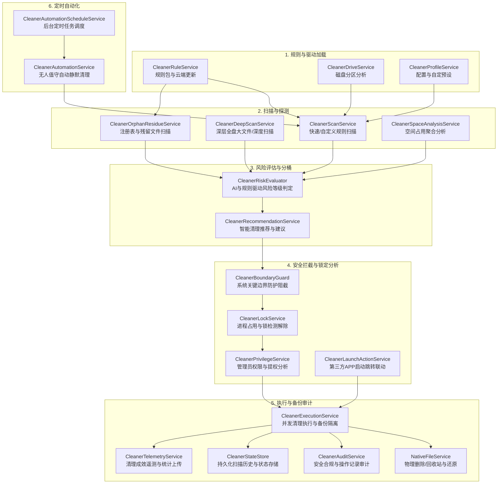

# BlueSapphire Cleaner 子系统架构与设计文档

本文档详尽阐述了 BlueSapphire 智能系统清理（Cleaner）模块的架构设计、数据流转、核心机制与服务类图，旨在为新加入团队的开发者提供一站式的技术架构索引，方便阅读与二次开发。

---

## 1. 整体架构图与流程调用链路

Cleaner 子系统通过高度解耦的微服务化设计（20+ 个核心组件类），实现了从**规则定义、空间扫描、风险评估、边界防护、锁定排查、提权与执行到结果审计**的全流程安全清理作业。

### 1.1 核心数据与调控流程 (Mermaid 流程图)

---

## 2. 核心技术概念解析

为了确保在清理用户磁盘垃圾时“绝对零误删、零故障、可追溯”，系统引入了以下关键核心设计：

### 2.1 风险分桶逻辑：Safe / Review / ViewOnly

系统通过 `CleanerRiskEvaluator` 和规则定义，对每一个扫描探测出来的文件/目录项（`CleanerScanItem`）进行分桶归类：
* **🟢 Safe (低风险/建议清理)**：纯粹的临时文件、系统缓存、日志残余或已废弃的应用数据。对系统和程序运行无任何影响，**默认勾选**，允许在无人值守或自动清理模式下静默处理。
* **🟡 Review (中风险/建议仔细甄别)**：可能包含用户的个性化配置文件、浏览器 Cookie、下载文件夹历史等。清理后可能会导致登录失效、缓存重建或丢失轻度数据，**默认不勾选**，需要用户在 UI 上明确勾选确认。
* **🔴 ViewOnly (高风险/仅供浏览)**：系统核心关键目录、驱动更新包或巨大体积的未知依赖数据。**严禁通过批量清理操作直接删除**，只能由用户在界面上阅读风险提示后，手动单项排查处理。

### 2.2 隔离区与还原机制 (Quarantine & Restore)

* **物理隔离**：当执行高敏感清理操作或匹配到需要备份的规则时，`CleanerExecutionService` 会借助 `NativeFileService` 将待清理目标并不是直接强删（Shift+Delete），而是移入本地防损隔离区或系统回收站（`%LOCALAPPDATA%\BlueSapphire\Quarantine` / Recycle Bin）。
* **一键快照还原**：所有清理批次通过 `CleanerStateStore` 写入持久化快照记录（`CleanerCleanupBatch` 和 `CleanerCleanupEntry`）。若发现清理后某应用程序异常，可随时调用 `RestoreLatestAsync` 或通过审计记录精准将文件从隔离区还原至 `OriginalPath`。

### 2.3 增量扫描与复用窗口 (Incremental Scan & Cache Reuse)

为了极大地降低大容量硬盘连续扫描时的 I/O 开销与 CPU 负载，`CleanerScanService` 内置了**时间窗口与哈希缓存复用机制**：
* **时间戳校验与指纹复用**：系统记录上一次成功扫描各具体路径的时间与文件指纹（大小、修改时间）。在短时期内的二次扫描（如进入页面重新触发），只要目标目录未发生变更，引擎直接复用缓存的计算结果（包括文件体积统计与风险分类），使热启动扫描在毫秒级完成。
* **增量并发扫描**：在大文件深层扫描 `CleanerDeepScanService` 中，通过基于主目录树分片并发抓取策略，避免遍历高耗时无变化的深层系统关键文件夹。

---

## 3. 关键文件与测试对应索引表

以下是 Cleaner 子系统下所有后台核心服务类文件（`Services/`）与其对应自动化单元测试件（`BlueSapphire.Tests/`）的完整索引，开发与修改时需遵循“修改即验证”原则：

| 服务模块 / 类名 | 职责说明 | 源文件路径 | 单元测试文件路径 |
| :--- | :--- | :--- | :--- |
| **`CleanerRuleService`** | 规则包加载、解析、内置基础规则与远程规则更新 | `Services/CleanerRuleService.cs` | `BlueSapphire.Tests/CleanerRuleServiceTests.cs` |
| **`CleanerScanService`** | 常规快速清理扫描、多线程管道扫描与增量复用 | `Services/CleanerScanService.cs` | `BlueSapphire.Tests/CleanerScanServiceTests.cs` |
| **`CleanerDeepScanService`** | 大文件、深度全盘扫描与特殊大容量目标分析 | `Services/CleanerDeepScanService.cs` | `BlueSapphire.Tests/CleanerDeepScanServiceTests.cs` |
| **`CleanerOrphanResidueService`** | 已卸载软件残留文件、孤立目录与注册表残余探测 | `Services/CleanerOrphanResidueService.cs` | `BlueSapphire.Tests/CleanerOrphanResidueServiceTests.cs` |
| **`CleanerSpaceAnalysisService`** | 磁盘占用可视化、层级结构化统计与聚类分析 | `Services/CleanerSpaceAnalysisService.cs` | `BlueSapphire.Tests/CleanerSpaceAnalysisServiceTests.cs` |
| **`CleanerRiskEvaluator`** | AI 辅助与规则协同评分、将扫描结果自动分桶归类 | `Services/CleanerRiskEvaluator.cs` | `BlueSapphire.Tests/CleanerRiskEvaluatorTests.cs` |
| **`CleanerRecommendationService`** | 智能一键清理建议生成与优先级推荐规则生成 | `Services/CleanerRecommendationService.cs` | `BlueSapphire.Tests/CleanerRecommendationServiceTests.cs` |
| **`CleanerBoundaryGuard`** | 系统防护边界检查、Windows 核心路径强力保护过滤 | `Services/CleanerBoundaryGuard.cs` | `BlueSapphire.Tests/CleanerBoundaryGuardTests.cs` |
| **`CleanerLockService`** | 扫描或删除时文件被进程锁定的探测与分析说明 | `Services/CleanerLockService.cs` | `BlueSapphire.Tests/CleanerLockServiceTests.cs` |
| **`CleanerPrivilegeService`** | Windows 权限检查、UAC 提权判断与特权提示 | `Services/CleanerPrivilegeService.cs` | `BlueSapphire.Tests/CleanerPrivilegeServiceTests.cs` |
| **`CleanerExecutionService`** | 核心清理执行引擎、并发批处理删除与还原调度 | `Services/CleanerExecutionService.cs` | `BlueSapphire.Tests/CleanerExecutionServiceTests.cs` |
| **`CleanerAuditService`** | 清理安全审计、历史报告生成与操作留痕追溯 | `Services/CleanerAuditService.cs` | `BlueSapphire.Tests/CleanerAuditServiceTests.cs` |
| **`CleanerStateStore`** | 清理历史批次、扫描缓存以及配置状态本地持久化 | `Services/CleanerStateStore.cs` | `BlueSapphire.Tests/CleanerStateStoreTests.cs` |
| **`CleanerTelemetryService`** | 清理成效数据统计、释放体积报告与脱敏安全上传 | `Services/CleanerTelemetryService.cs` | `BlueSapphire.Tests/CleanerTelemetryServiceTests.cs` |
| **`CleanerProfileService`** | 预设配置管理（开发者、办公者、游戏玩家定制预设） | `Services/CleanerProfileService.cs` | `BlueSapphire.Tests/CleanerProfileServiceTests.cs` |
| **`CleanerDriveService`** | 本地逻辑驱动器盘符识别、可用空间与格式监测 | `Services/CleanerDriveService.cs` | `BlueSapphire.Tests/CleanerDriveOptionTests.cs` |
| **`CleanerAutomationService`** | 无人值守自动静默清理作业逻辑与后台处理引擎 | `Services/CleanerAutomationService.cs` | `BlueSapphire.Tests/CleanerAutomationServiceTests.cs` |
| **`CleanerAutomationScheduleService`**| 计划任务注册、定周期调度与 Windows Scheduler 桥接 | `Services/CleanerAutomationScheduleService.cs` | `BlueSapphire.Tests/CleanerAutomationScheduleServiceTests.cs` |
| **`CleanerAnalysisPathPlanner`** | 自定义扫描与分析路径优化规划工具 | `Services/CleanerAnalysisPathPlanner.cs` | `BlueSapphire.Tests/CleanerAnalysisPathPlannerTests.cs` |
| **`CleanerLaunchActionService`**| 清理后关联第三方维护应用快速启动联动服务 | `Services/CleanerLaunchActionService.cs` | `BlueSapphire.Tests/CleanerLaunchActionServiceTests.cs` |
| **`CleanerPathSafety`** | 路径安全性静态验证辅助类 | `Services/CleanerPathSafety.cs` | *(包含在 BoundaryGuard/ScanService 测试件中)* |

---

## 4. 日志与异常观测性规范

Cleaner 子系统的所有关键节点均已打通 `Microsoft.Extensions.Logging`，支持标准的依赖注入 `ILogger<T>`。
在调试与问题追踪时：
1. **统一日志路径**：`%LOCALAPPDATA%\BlueSapphire\Logs\app.log`
2. **分类检索过滤**：日志中携带完整 Category（如 `[CleanerScanService]`、`[CleanerExecutionService]`、`[CleanerRuleService]`），可通过 Category 快速定位特定模块的扫描统计、耗时、异常及远程通信状态。
