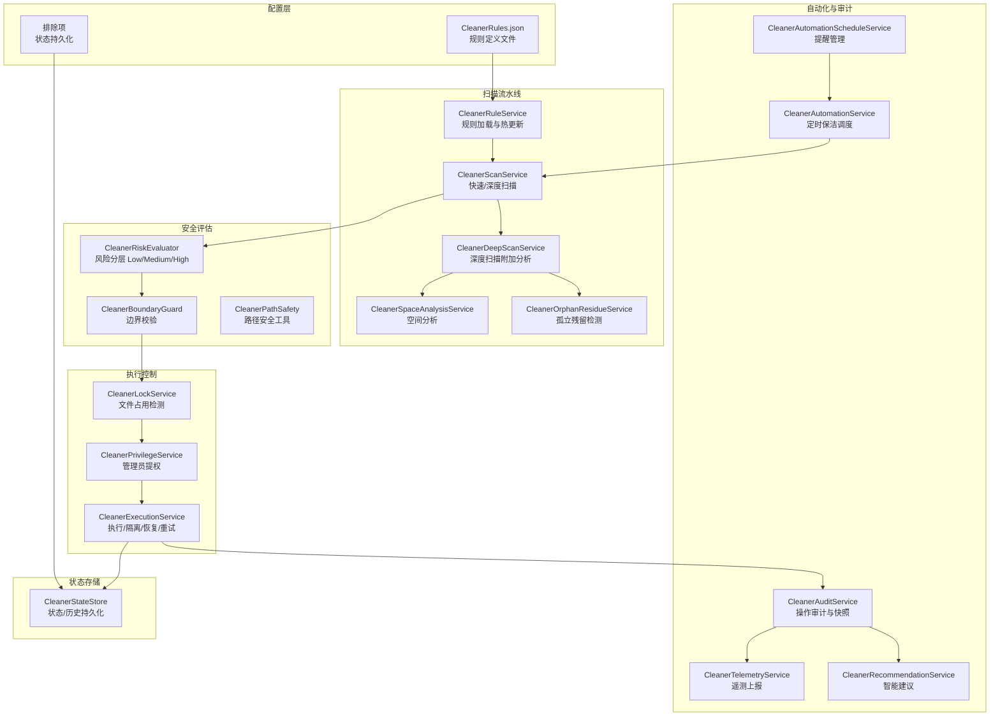

# Cleaner 子系统架构文档

> BlueSapphire Cleaner Assistant — 架构与数据流说明  
> 版本：1.0.5  
> 最后更新：2026-06-15

---

## 概述

Cleaner Assistant（清理助手）是 BlueSapphire 的系统垃圾清理模块，提供从规则匹配、风险分层、安全边界校验到执行、隔离恢复的完整流水线。设计原则是“保守清理、可恢复、可审计”。

---

## 整体架构



---

## 核心概念

### 扫描分桶（Safe / Review / ViewOnly）

扫描结果按风险分为三桶：

| 桶 | 风险等级 | 默认行为 | 说明 |
|---|---|---|---|
| **Safe（安全）** | Low | 默认选中 | 可信规则 + 临时文件/缓存，可直接清理 |
| **Review（审阅）** | Medium | 默认选中 | 中风险项，建议用户确认后清理 |
| **ViewOnly（只读）** | High | 不选中、不可选 | 高风险项（如文档目录），仅供查看 |

分桶逻辑由 `CleanerRiskEvaluator` 根据规则来源、路径位置、文件年龄、大小等综合判定。

### 隔离区（Quarantine）

中低风险项的清理默认走隔离模式：文件被移动到隔离目录而非直接删除。用户可通过 `CleanerExecutionService.RestoreLatestAsync()` 恢复最近一次清理的所有文件，或通过 `RestoreEntryAsync()` 恢复单个条目。

### 增量扫描复用窗口

快速扫描的结果会缓存 5 分钟（`IncrementalReuseWindow`）。当用户在 5 分钟内触发深度扫描时，快速扫描结果会被复用，仅补充深度特有的规则匹配，避免重复 I/O。

### 边界守卫（BoundaryGuard）

系统级规则（如 Windows Temp）必须声明 `BoundaryRoots`（允许清理的根目录白名单）。即使以管理员权限运行，清理操作也不会超出这些白名单边界。`CleanerBoundaryGuard.Validate()` 会在执行前校验。

### 提权模式

标准权限下，系统级目录（如 `C:\Windows\Temp`）可能因权限不足而跳过。用户可以选择“管理员模式”，此时 `CleanerPrivilegeService.RestartElevatedAsync()` 会以 `runas` 重新启动进程。失败条目支持提权后重试。

---

## 关键文件索引

### Services（服务层）

| 文件 | 职责 | 对应测试 |
|---|---|---|
| `CleanerRuleService.cs` | 规则加载、缓存、热更新 | `CleanerRuleServiceTests.cs` |
| `CleanerScanService.cs` | 快速/深度扫描、增量复用 | `CleanerScanServiceTests.cs` |
| `CleanerDeepScanService.cs` | 深度扫描附加分析（空间、孤立残留） | `CleanerDeepScanServiceTests.cs` |
| `CleanerSpaceAnalysisService.cs` | 磁盘空间分析 | `CleanerSpaceAnalysisServiceTests.cs` |
| `CleanerOrphanResidueService.cs` | 孤立残留检测 | `CleanerOrphanResidueServiceTests.cs` |
| `CleanerRiskEvaluator.cs` | 风险分层评定 | `CleanerRiskEvaluatorTests.cs` |
| `CleanerBoundaryGuard.cs` | 系统级路径边界校验 | `CleanerBoundaryGuardTests.cs` |
| `CleanerPathSafety.cs` | 路径规范化与安全检查 | — |
| `CleanerLockService.cs` | 文件占用检测 | — |
| `CleanerPrivilegeService.cs` | 管理员提权 | — |
| `CleanerExecutionService.cs` | 执行/隔离/恢复/重试 | `CleanerExecutionServiceTests.cs` |
| `CleanerAuditService.cs` | 操作审计与快照 | `CleanerAuditServiceTests.cs` |
| `CleanerAutomationService.cs` | 自动保洁调度 | `CleanerAutomationServiceTests.cs` |
| `CleanerAutomationScheduleService.cs` | 提醒管理 | `CleanerAutomationScheduleServiceTests.cs` |
| `CleanerTelemetryService.cs` | 遥测上报 | `CleanerTelemetryServiceTests.cs` |
| `CleanerRecommendationService.cs` | 智能建议生成 | `CleanerRecommendationServiceTests.cs` |
| `CleanerProfileService.cs` | 用户偏好模型 | `CleanerProfileServiceTests.cs` |
| `CleanerLaunchActionService.cs` | 命令行参数解析 | `CleanerLaunchActionServiceTests.cs` |
| `CleanerDriveService.cs` | 磁盘信息 | `CleanerDriveOptionTests.cs` |
| `CleanerStateStore.cs` | 状态与历史持久化 | `CleanerStateStoreTests.cs` |

### ViewModels（视图模型层）

| 文件 | 职责 |
|---|---|
| `CleanerAssistantViewModel.cs` | 顶层协调器，持有所有子 VM |
| `CleanerAssistantViewModel.Properties.cs` | UI 绑定属性（partial class） |
| `Cleaner/CleanerScanViewModel.cs` | 扫描触发、进度、结果分桶 |
| `Cleaner/CleanerCleanupViewModel.cs` | 清理执行、隔离恢复 |
| `Cleaner/CleanerAutomationViewModel.cs` | 自动保洁调度 UI |
| `Cleaner/CleanerRuleManagementViewModel.cs` | 规则包管理 |
| `Cleaner/CleanerDriveSelectionViewModel.cs` | 磁盘选择 |

### Models（模型层）

| 文件 | 内容 |
|---|---|
| `CleanerModels.cs` | 所有 Cleaner 相关的数据模型（规则定义、扫描项、清理条目、审计快照等） |
| `AppMessages.cs` | 跨 ViewModel 消息定义 |

### Views（视图层）

| 文件 | 说明 |
|---|---|
| `CleanerAssistantPage.xaml` | 清理助手主页面 |
| `CleanerAssistantPage.xaml.cs` | 页面代码后置 |

---

## 典型数据流

### 用户触发快速扫描 → 清理

```
1. CleanerAssistantPage 按钮绑定 → CleanerScanViewModel.StartQuickScanCommand
2. CleanerScanViewModel 调用 CleanerScanService.ScanAsync(Quick, ...)
3. CleanerScanService 枚举规则 → 匹配文件 → 调用 CleanerRiskEvaluator
4. 结果分桶（Safe/Review/ViewOnly） → 通知 UI 刷新
5. 用户点击“清理” → CleanerAssistantViewModel.RunCleanupCommand
6. 收集选中项 → CleanerExecutionService.ExecuteAsync(items, ...)
7. 执行前校验：BoundaryGuard → LockService → PrivilegeService
8. 执行隔离（移动文件）或直接删除 → 记录审计
9. CleanerStateStore 持久化清理历史 → UI 显示结果
```

### 自动保洁

```
1. CleanerAutomationService 检查是否到期
2. 到期则发送 RunAutomaticLowRiskCleanupMessage
3. CleanerAssistantViewModel 接收消息
4. 仅处理 Safe 桶中已选中的低风险项
5. 静默清理 → 不显示确认对话框
```

---

## 扩展规则

规则定义在 `Assets/CleanerRules.json`（33KB），格式为 `CleanerRuleManifest`。新增规则只需在该 JSON 中添加条目，应用启动时会通过 `CleanerRuleService` 自动加载。支持在线规则包热更新（通过发布通道机制）。

---

## 安全设计要点

1. **默认不删高风险项** — High 风险项进入 ViewOnly 桶，不可选中
2. **隔离优于删除** — 中低风险项默认走 Quarantine 模式
3. **边界不可逾越** — 系统级规则必须声明且校验 BoundaryRoots
4. **全量审计** — 每次扫描、清理、恢复均记录到 CleanerAuditService
5. **排除优先** — 用户排除的路径在扫描阶段即被过滤，不会进入结果列表
